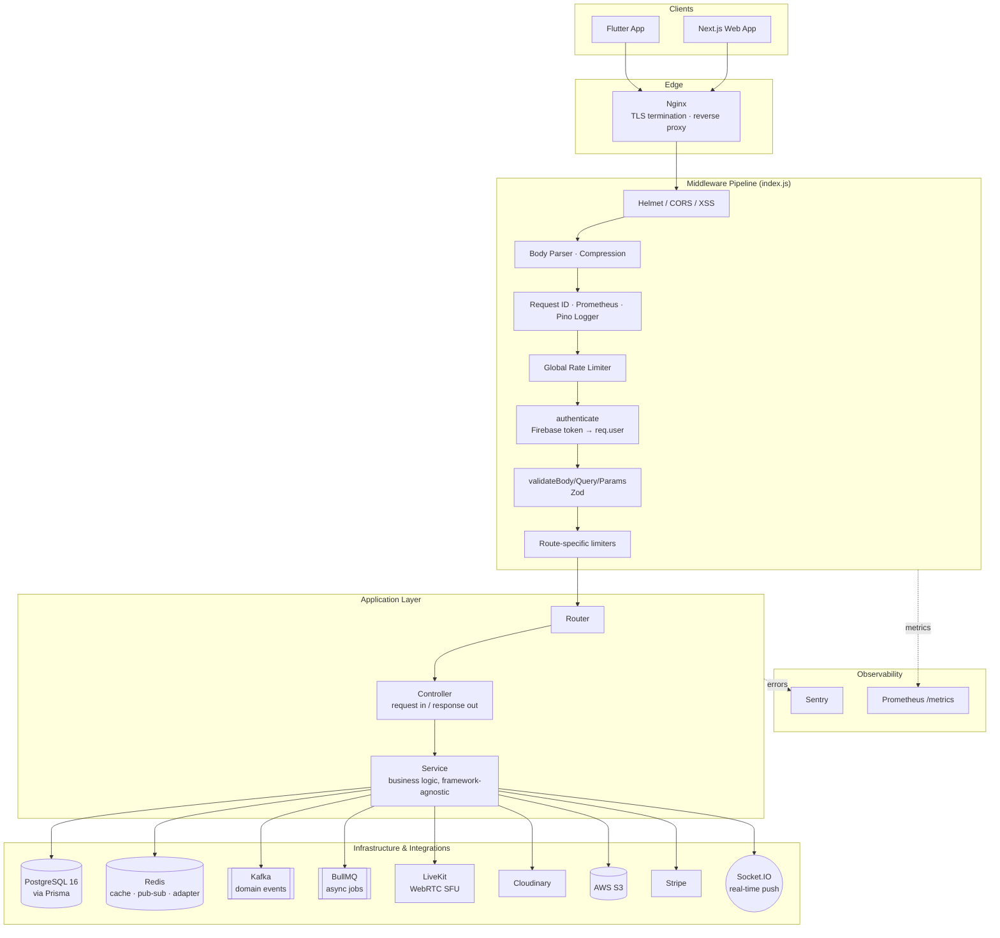
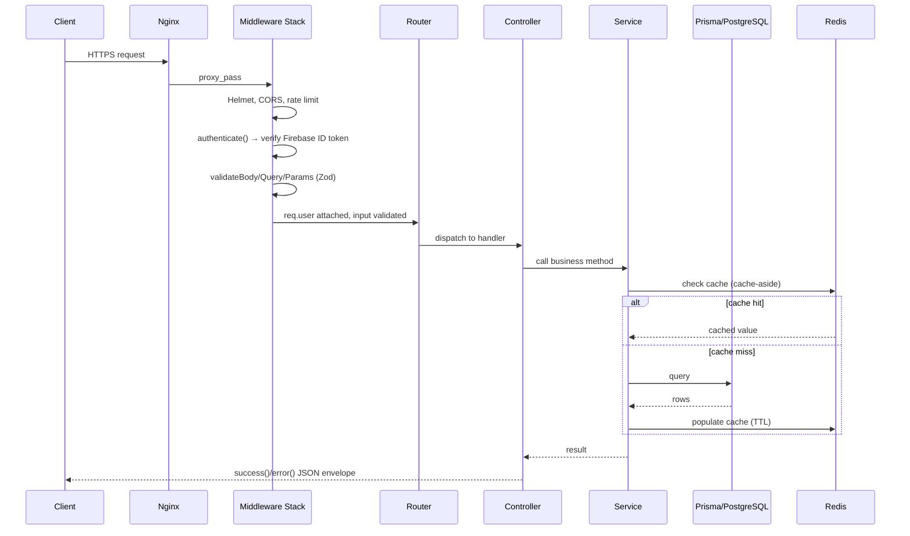
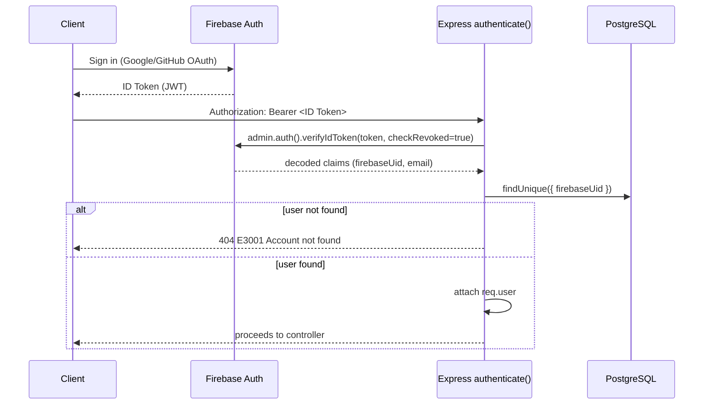
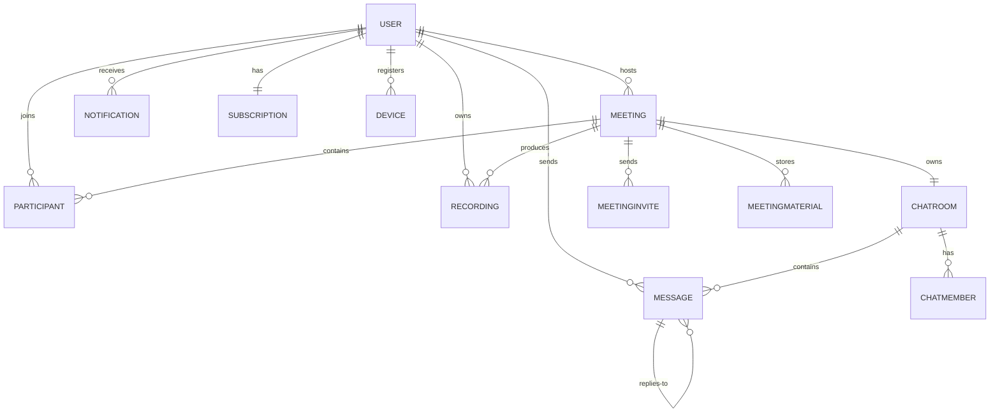
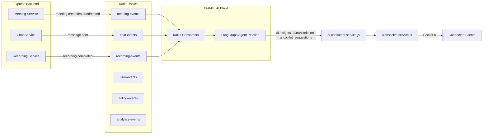
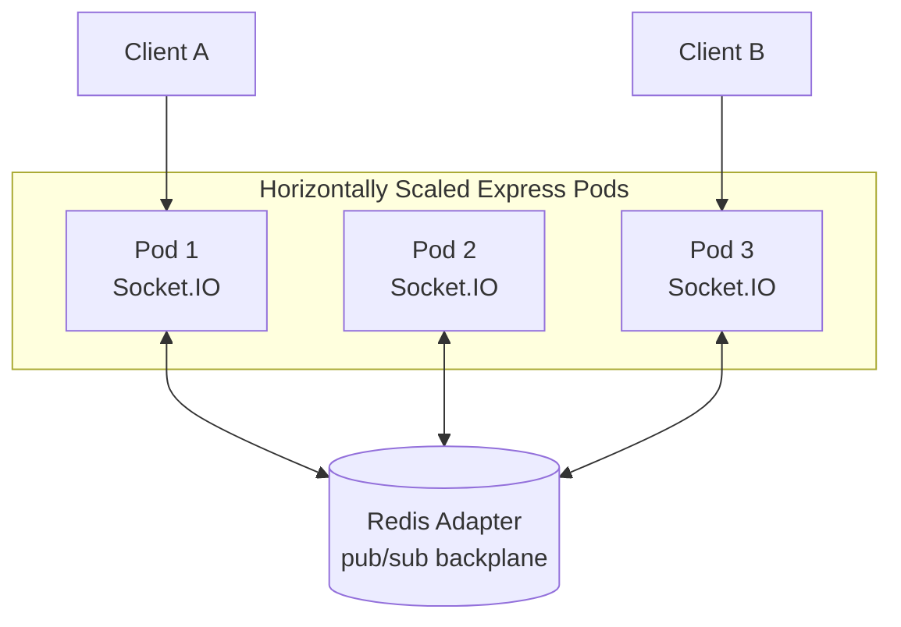
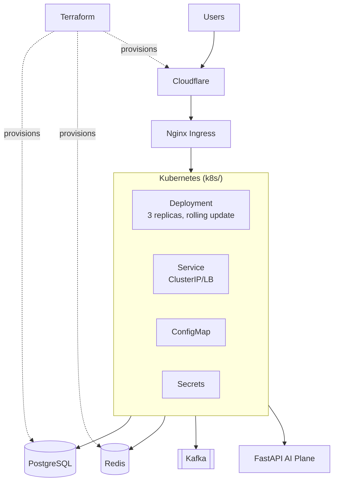

# SpeakUp Backend — Express API & Real-Time Core

The system of record for SpeakUp: authentication, meetings, chat, billing, recordings, and the event backbone that feeds the AI intelligence plane. Built on Node.js 22 + Express 5 with a strict layered architecture, event-driven integrations, and horizontal scalability as first-class requirements.

---

## Design Philosophy

| Decision | Rationale |
| --- | --- |
| **OAuth-only auth (Firebase Admin SDK)** | No password storage, no credential-stuffing surface, no reset-flow attack vectors — delegates identity to Google/GitHub and verifies signed ID tokens server-side |
| **ES Modules, no CommonJS** | Aligns with modern Node tooling, native top-level `await`, tree-shakeable, single module standard across the codebase |
| **Prisma ORM over raw SQL / other ORMs** | Type-safe queries, declarative schema as single source of truth, safe migrations, auto-generated client — reduces SQL-injection surface by construction |
| **Kafka for domain events, BullMQ for jobs** | Deliberate separation of concerns: Kafka is an durable, replayable **event log** consumed by multiple services (this backend + the FastAPI AI plane); BullMQ is a **task queue** for fire-and-forget internal work (email, notification fan-out) that doesn't need cross-service replay |
| **Redis everywhere (cache, pub/sub, Socket.IO adapter, BullMQ backing store)** | One operational dependency instead of three — cache-aside reads, horizontal Socket.IO scaling, and job backing all reuse the same cluster |
| **Zod at the boundary** | Schema validation happens once, at `validateBody/Query/Params`, before any business logic runs — invalid input never reaches a service or the database |
| **Service layer never touches `req`/`res`** | Controllers are the only layer aware of HTTP; services are framework-agnostic and unit-testable in isolation |
| **AppError + centralized error mapping** | Every failure — including raw Prisma error codes — is normalized into one JSON error shape with a stable `E-code`, so clients never need to branch on library internals |
| **Cloudinary for user media, S3 for recordings** | Cloudinary optimizes for transformation-on-read (avatars, thumbnails); S3 is cheaper for large, rarely-transformed binary blobs (recordings) accessed via pre-signed URLs |
| **Redis-adapter Socket.IO instead of sticky sessions** | Any pod can serve any socket; horizontal scaling doesn't require session affinity at the load balancer |

---

## Layered Architecture



**Why this shape**: every request passes through the *same* security/validation gate regardless of route, so no controller can accidentally skip auth or input validation. The service layer is the only place business rules live — controllers stay thin, services stay portable (they're what the `workers.js` BullMQ processors and the Kafka consumers reuse, instead of duplicating logic).

---

## Request Lifecycle



---

## Authentication Flow

Firebase is the **identity provider only** — this backend never issues its own session tokens. Every request re-verifies the caller's Firebase ID token, which keeps revocation (disabled/deleted accounts) effective immediately.



This is why `AccountGuard`-style checks exist client-side too (see the Flutter skills doc): a 404/E-code from this exact flow signals a deleted or suspended account, not a transient error.

---

## Module Pattern

Every domain in `modules/` is a vertical slice, not a horizontal layer — this keeps related code co-located and makes each module independently testable/removable.

```
<module>.routes.js      → Express Router: endpoint + middleware wiring only
<module>.controller.js  → req/res translation, no business logic
<module>.service.js     → Prisma queries, cache, events — the actual domain logic
<module>.validator.js   → Zod schemas consumed by validate.middleware.js
```

11 modules follow this pattern: `auth`, `user`, `meeting`, `room`, `chat`, `notification`, `recording`, `analytics`, `billing`, `search`, `legal`.

---

## Data Layer



- **Prisma** owns the schema (`prisma/schema.prisma`) as the single source of truth; migrations are generated, never hand-written.
- Connection pooling is explicit (`config/prisma.js`): max 20 connections, 30s idle timeout, 10s statement timeout — tuned to avoid PostgreSQL connection exhaustion under Kubernetes horizontal scaling.
- `Participant` has a composite unique constraint on `[meetingId, userId]`, enforcing "one active participant row per user per meeting" at the database level rather than in application code.

---

## Caching Strategy — Cache-Aside

```
Read:  Redis GET → miss → PostgreSQL query → Redis SET (TTL) → return
Write: PostgreSQL write → Redis DEL (invalidate) → next read repopulates
```

| Key | TTL | Why |
| --- | --- | --- |
| `USER_PROFILE` | 1 hour | Profile data changes rarely; long TTL cuts DB load |
| `MEETING` | 30 min | Balances freshness against read-heavy meeting-detail traffic |
| `ROOM_STATE` | 5 min | Live room state changes frequently — short TTL bounds staleness |

Cache-aside (rather than write-through) was chosen because most reads (meeting lookups, profile fetches) vastly outnumber writes, and it fails open — a Redis outage degrades to "always hit Postgres," not a hard failure.

---

## Event-Driven Backbone (Kafka)

The backend and the FastAPI AI plane are **separately deployable services** that never call each other synchronously for media processing — they communicate through Kafka so either side can be down, slow, or scaled independently without blocking a video call.



`ai-consumer.service.js` is the one place this backend listens to Kafka — it bridges AI results back into the synchronous world clients understand (WebSocket events), so the AI plane never needs to know Socket.IO exists.

---

## Async Jobs (BullMQ)

Kafka is for **cross-service, replayable domain events**. BullMQ is for **in-process, at-least-once background work** that only this backend cares about: sending emails, fanning out push notifications, post-processing analytics. Using a job queue here instead of Kafka avoids over-engineering simple retryable tasks with consumer-group semantics they don't need.

```
Controller/Service → queue.add(job) → Redis-backed queue → workers.js processor → side effect (email sent, notification pushed)
```

Retries, backoff, and dead-letter handling are BullMQ built-ins — no custom retry logic required.

---

## Real-Time Layer



Without the Redis adapter, a broadcast (`emitToMeeting`) would only reach clients connected to the *same* pod. The adapter republishes emits across all pods via Redis pub/sub, so `meeting:participant_joined` reaches every participant regardless of which pod they're socketed to — enabling stateless horizontal scaling without sticky sessions at the load balancer.

---

## Media & File Strategy

| Store | Used For | Why |
| --- | --- | --- |
| **Cloudinary** | Avatars, meeting materials | On-the-fly transformations (resize, format conversion), CDN delivery, small-file optimized |
| **AWS S3** | Recordings | Large binary blobs, infrequent access, cheaper at scale, accessed via short-lived pre-signed URLs (no public bucket exposure) |

---

## Billing (Stripe)

Checkout and customer-portal sessions are created server-side (`billing.service.js`); the raw Stripe webhook route (`/billing/webhook`) is mounted **before** the JSON body parser with `express.raw()` semantics so Stripe's signature verification (`STRIPE_WEBHOOK_SECRET`) can validate the untouched payload — a common pitfall this backend avoids explicitly.

| Plan | Max Participants | Max Duration | Recordings |
| --- | --- | --- | --- |
| FREE | 50 | 60 min | — |
| PRO | 300 | 8 hrs | Included |
| ENTERPRISE | 1,000 | Unlimited | Included |

---

## Security Posture (OWASP-Aligned)

- **Helmet** — CSP, HSTS, X-Frame-Options against clickjacking/XSS
- **CORS allowlist** — no wildcard origins in production
- **Zod validation at the edge** — rejects malformed/oversized/type-confused input before it reaches Prisma
- **Rate limiting per concern** — global (100/15min), auth (30/15min), meeting creation (10/min), chat (60/min), recording (5/min) — brute-force and abuse containment scoped to the risk of each endpoint
- **No password storage** — OAuth-only removes an entire class of credential-leak risk
- **Pre-signed URLs, not public buckets** — recordings/materials are never publicly reachable by guessable URL
- **Structured error codes (`E1xxx`–`E9xxx`)** — clients branch on stable codes, never on error message strings or raw stack traces

---

## Observability

| Tool | Role |
| --- | --- |
| **Pino** | Structured JSON logs, request-scoped via request-ID middleware |
| **Prometheus** | `/metrics` endpoint, request duration histograms, scraped by k8s |
| **Sentry** | Exception capture with request context, wired in before and after the route stack |
| **`/health`, `/health/ready`** | Liveness vs. readiness split — readiness checks downstream deps (DB, Redis) before accepting traffic |

---

## Deployment Topology



Infrastructure is codified: `terraform/` provisions cloud resources (database, Redis, Cloudflare), `k8s/` defines the runtime (3-replica rolling deployment with liveness/readiness probes), and `Dockerfile` is a 3-stage build (install deps → `prisma generate` → slim production image) to keep the final image free of build-time dependencies.

Graceful shutdown on `SIGTERM`/`SIGINT` drains in order: HTTP server → Prisma → Redis → AI Kafka consumer → Kafka producer → BullMQ — so in-flight requests and jobs finish before dependencies disconnect.

---

## Key Commands

```bash
make dev            # Nodemon watch mode
make db:migrate      # Create + apply Prisma migration
make db:studio       # Prisma Studio GUI
make lint            # ESLint
make test:run        # Vitest (CI mode)
make docker-up       # Full local stack: postgres, redis, kafka, livekit, mailhog
make k8s-apply       # Deploy to cluster
```

See [skills.md](skills.md) for the complete file-by-file map, all API routes, environment variables, and the database schema.
