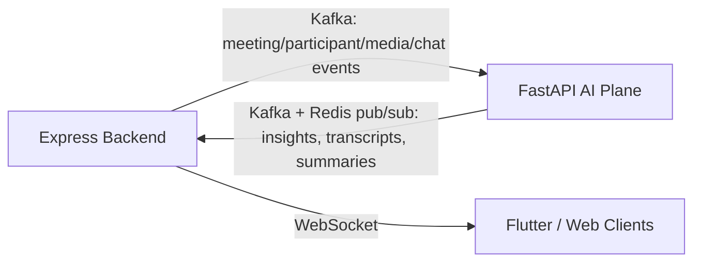
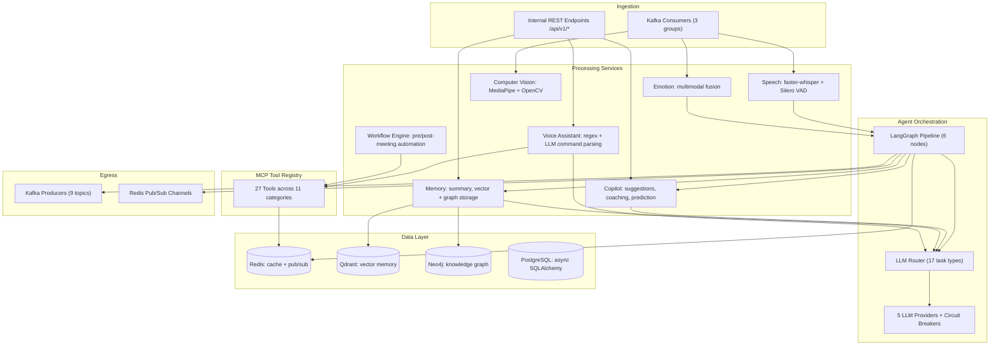
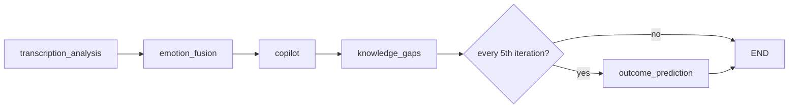
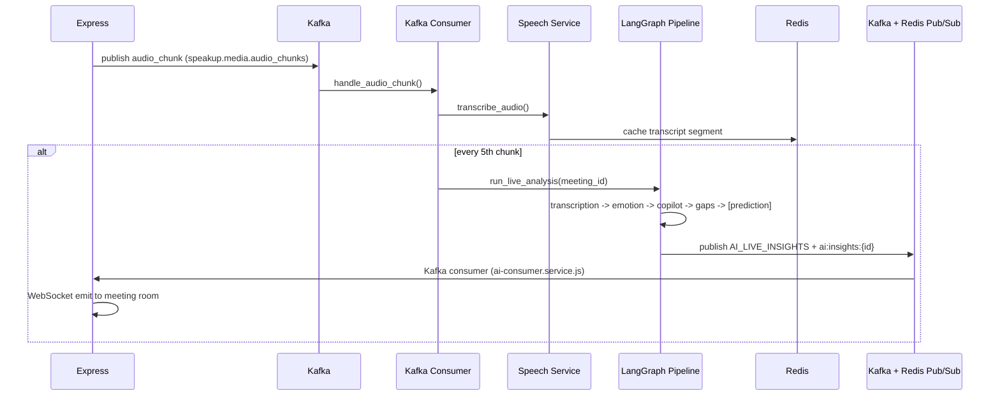
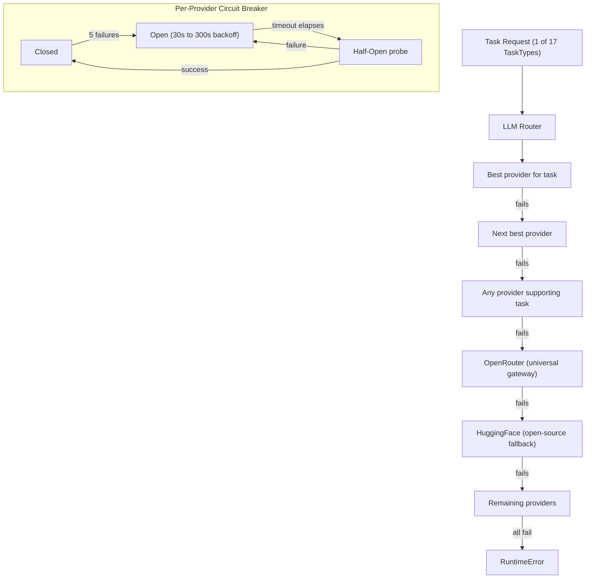
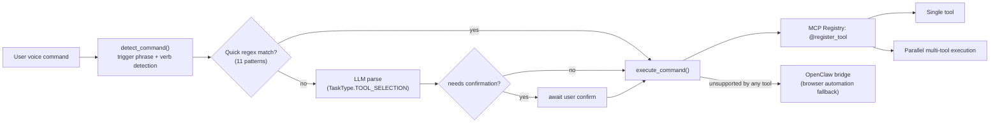
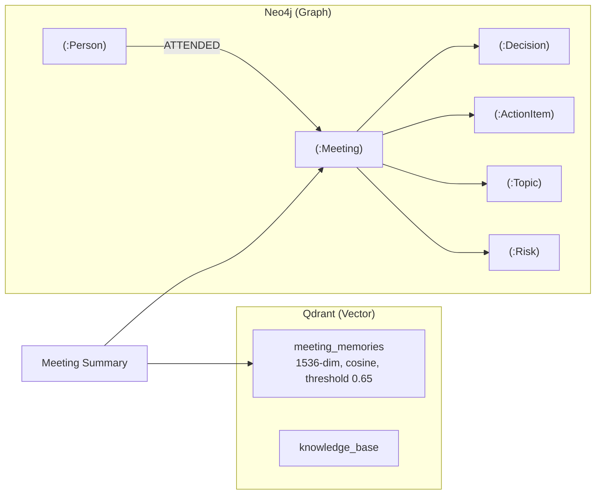

# SpeakUp AI — FastAPI Intelligence Plane

The AI brain of SpeakUp: a Python 3.11 / FastAPI service that listens to every meeting via Kafka, runs speech, vision, and emotion models through a LangGraph agent pipeline, and turns conversation into transcripts, coaching, memory, and 27 automated real-world actions. It owns zero user data, zero auth, zero billing — that's the Express backend's job. This service only reasons and acts.

---

## Design Philosophy

| Decision | Rationale |
| --- | --- |
| **Separate service from Express, not a library** | ML workloads (Whisper, MediaPipe, LLM calls) have different scaling, GPU, and failure characteristics than a CRUD API — decoupling lets each scale and deploy independently |
| **Kafka in, Kafka + Redis pub/sub out — no synchronous calls into media path** | A slow LLM call or model load must never block a live video call; the service can lag or restart without dropping a meeting |
| **Internal-API-key auth, not user tokens** | This plane never sees end users directly — every caller is Express itself, so identity is service-to-service (`X-Internal-API-Key` / HMAC signature), not OAuth |
| **5 LLM providers behind one router + circuit breaker** | No single vendor outage or rate limit should stall an in-meeting feature; the task-based router picks the best model for the job and fails over automatically |
| **LangGraph for orchestration, not ad-hoc function chains** | The live-analysis pipeline is a stateful, multi-step graph (transcription → emotion → copilot → gaps → prediction) — LangGraph gives explicit state, ordering, and conditional branching instead of nested callbacks |
| **MCP tool registry (`@register_tool`)** | 27 integrations (email, Slack, Jira, GitHub, Notion, CRM...) share one discovery + execution contract, so the LLM can call any of them via a single OpenAI-style function schema instead of bespoke glue per integration |
| **Vector DB (Qdrant) + Graph DB (Neo4j), not one store** | Semantic recall ("what did we discuss like this before") needs embeddings/cosine similarity; relationship intelligence ("who decided what, who owns which action item") needs graph traversal — one database can't do both well |
| **Non-fatal startup for ML models, Qdrant, Neo4j** | A model load failure or graph DB hiccup shouldn't crash the whole service — it degrades gracefully (feature unavailable) instead of taking down transcription, LLM routing, etc. |
| **Celery separate from Kafka consumers** | Kafka consumers react to *events* in real time; Celery runs *heavy, retryable, long-running* jobs (full summary generation, batch transcription) that shouldn't block the consumer's event loop |
| **Regex-first, LLM-second command parsing** | 11 quick regex patterns resolve common voice commands ("send recap email to...") with zero LLM latency/cost; only ambiguous commands fall through to LLM-based `TOOL_SELECTION` |

---

## Role in the System



This service never talks to clients directly. It consumes raw signal, produces structured insight, and Express is the only thing clients ever connect to.

---

## Layered Architecture



---

## Live Analysis Pipeline (LangGraph)

Runs roughly every 10 seconds while a meeting is active, triggered every 5th audio chunk.



**State** (`MeetingAgentState`, a `TypedDict`) flows through every node — each node reads what it needs and appends its output, rather than passing narrow function arguments. This makes the pipeline trivially extensible: a new node just declares which state fields it reads/writes.

**Post-meeting graph** is a single node: `summary → END` — generates the full meeting summary and triggers memory storage.

---

## Real-Time Sequence



---

## Multi-LLM Routing & Resilience



Task types span real-time (`COPILOT_SUGGESTIONS`, `EMOTION_ANALYSIS`), heavy (`MEETING_SUMMARY`, `COACHING_REPORT`), agentic (`TOOL_SELECTION`, `WORKFLOW_PLANNING`), and content generation (`RECAP_EMAIL`, `ACTION_ITEMS`) — each mapped to the provider best suited for it (e.g., Claude for long-context reasoning, Gemini Flash for low-latency real-time calls).

---

## MCP Tool Registry & Voice Assistant



27 tools across 11 categories (email, calendar, messaging, project management, docs, code, CRM, search, file management, social, automation) all expose the same `execute(params) -> result` contract, so `/tools/schema` can generate one OpenAI function-calling schema for the entire toolbox without per-integration branching in the LLM prompt.

---

## Workflow Automation

| Workflow | Steps | Execution |
| --- | --- | --- |
| **Post-meeting** (6 steps) | draft recap → send email → Slack summary → Jira/Linear tickets → Notion notes → calendar follow-up | Sequential where dependent (recap must exist before send), rest run as optional, non-blocking steps |
| **Pre-meeting** (5 steps) | email search, Slack search, calendar check, Jira search, web search — per attendee/topic | Fully parallel, dependency-free |

Retries: max 2, exponential backoff, optional steps never block the workflow's overall completion.

---

## Data Layer



- **Qdrant** answers "find meetings semantically similar to X" — embedding-based recall.
- **Neo4j** answers "who decided what, who owns this action item, how do these people interact over time" — structural/relationship queries embeddings can't express.
- Both are written together after every meeting (`memory/meeting_memory.py`), so semantic and relational views never drift out of sync.

---

## Kafka Contract

| Direction | Topics | Purpose |
| --- | --- | --- |
| **Consumed** (6, from Express) | `speakup.meeting.events`, `speakup.participant.events`, `speakup.recording.events`, `speakup.media.audio_chunks`, `speakup.media.video_frames`, `speakup.chat.messages` | Raw signal in — 3 consumer groups isolate media-heavy traffic from low-volume meeting/chat events |
| **Produced** (9, to Express) | `speakup.ai.transcription`, `speakup.ai.live_insights`, `speakup.ai.emotion_signals`, `speakup.ai.coaching_hints`, `speakup.ai.copilot_suggestions`, `speakup.ai.meeting_summary`, `speakup.ai.action_items`, `speakup.ai.memory_updates`, `speakup.ai.cv_analysis` | Structured insight out — Express's `ai-consumer.service.js` is the only reader |

Separate consumer groups (`speakup-ai-meeting-events`, `speakup-ai-media`, `speakup-ai-chat`) mean a burst of video frames never delays a meeting-ended event from being processed.

---

## Celery Workers

Broker/backend on dedicated Redis DBs (2/3) keep job state isolated from the cache/pub-sub traffic on Redis DB 0.

| Task | Queue | Purpose | Retries |
| --- | --- | --- | --- |
| `ai.generate_meeting_summary` | speakup-ai-summary | Full post-meeting summary + memory write | 3 |
| `ai.store_meeting_memory` | speakup-ai-memory | Embeddings + graph node storage | 3 |
| `ai.batch_transcribe` | speakup-ai-inference | Transcribe a full recording after the fact | 2 |

---

## Security

- **`verify_internal_api_key`** — constant-time HMAC comparison against `EXPRESS_INTERNAL_API_KEY`; every endpoint except `/health*` and `/metrics` requires it
- **`verify_service_token`** — Bearer token + `X-Service-Signature` HMAC + `X-User-Context` for endpoints that need to know *which* end user triggered the call, without ever handling that user's credentials
- **No public endpoints touch PII directly** — user identity flows through Express; this service only ever sees `meeting_id` / `user_id` references
- **Custom exception taxonomy** (`AIServiceError`, `ModelNotLoadedError`, `InferenceTimeoutError`, `RateLimitExceededError`, ...) — callers get typed, predictable failures instead of raw stack traces

---

## Observability

| Tool | Role |
| --- | --- |
| **structlog** | JSON logs in production, human-readable console in dev |
| **Prometheus** | `/metrics` — inference latency, queue depth, request timing |
| **Sentry** | Exception capture, initialized only if `SENTRY_DSN` is set |
| **`/health`, `/health/ready`, `/health/detailed`** | Liveness vs. dependency readiness (Redis, Kafka, Qdrant, Neo4j) vs. full model/connection status |

---

## Startup & Shutdown

```mermaid
flowchart LR
    S1["Redis connect"] --> S2["Kafka producer connect"]
    S2 --> S3["Qdrant init (non-fatal)"]
    S3 --> S4["Neo4j init (non-fatal)"]
    S4 --> S5["Load Whisper + Silero VAD (non-fatal)"]
    S5 --> S6["Load MediaPipe (non-fatal)"]
    S6 --> S7["Start Kafka consumers (3 groups)"]
    S7 --> S8["Init 5 LLM providers"]
    S8 --> S9["Load MCP registry (27 tools)"]
    S9 --> S10["Check OpenClaw (optional)"]
    S10 --> S11["Init Sentry"]
```



Non-fatal steps mean a missing GPU, an unreachable Neo4j instance, or a model download failure degrades specific features instead of blocking the whole service from starting. Shutdown reverses the dependency order: LLM providers → OpenClaw → Kafka → Redis → Qdrant → Neo4j.

---

## Deployment

8-service Docker Compose stack: `speakup-ai` (FastAPI), `celery-worker`, `qdrant`, `neo4j`, `redis`, `kafka`, `zookeeper`, `postgres`. Multi-stage `Dockerfile` (base → deps → development/production) keeps the production image free of dev tooling. CI (`ci.yml`) runs lint (ruff + mypy) → security (bandit, safety, gitleaks) → tests → Docker build → deploy.

---

## Key Commands

```bash
make dev             # Uvicorn with reload
make prod            # Gunicorn, 4 workers
make celery          # Start Celery worker
make migrate         # Apply Alembic migrations
make docker-up       # Full local 8-service stack
make lint            # Ruff
make typecheck       # mypy
make security        # bandit + safety + gitleaks
make test-cov        # Full suite with coverage
```

See [skills.md](skills.md) for the complete file-by-file map, all API routes, Pydantic schemas, and environment variables.
