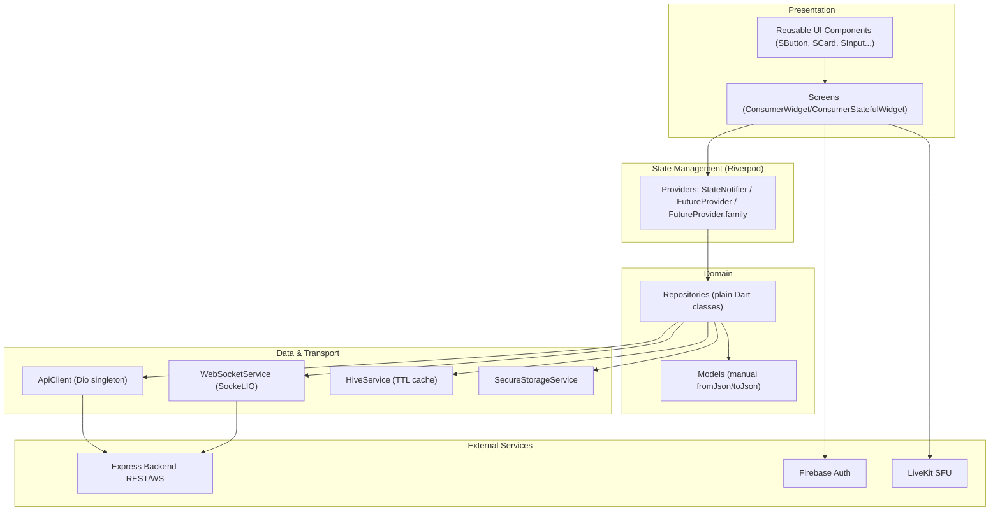
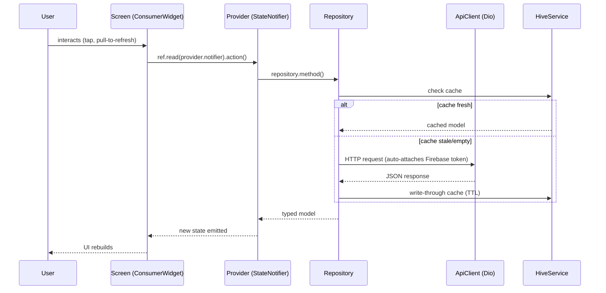
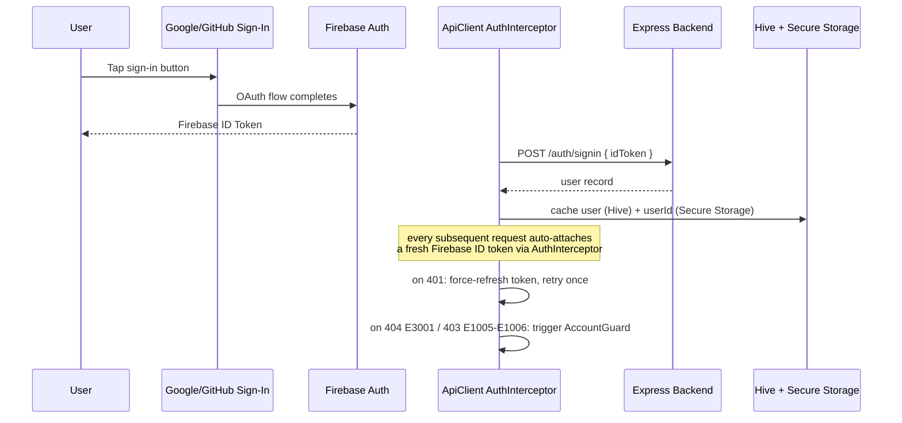
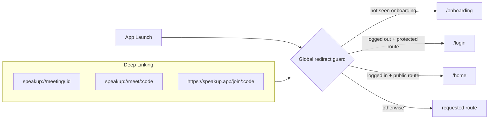
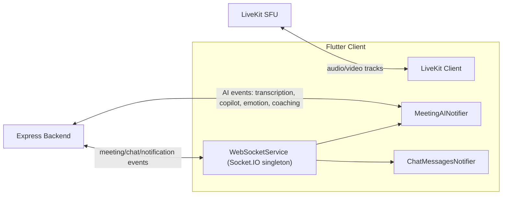
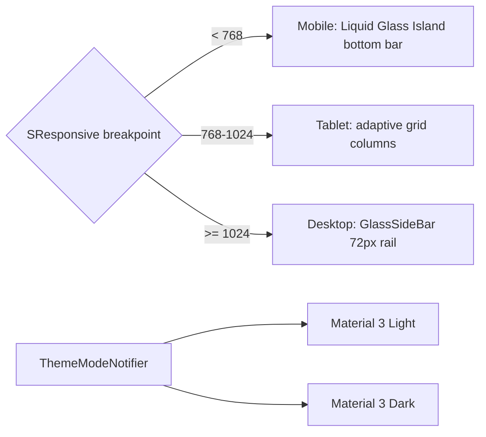

# SpeakUp Flutter — Cross-Platform Client

The single codebase behind every SpeakUp surface — iOS, Android, Web, Windows, macOS, Linux — built on Flutter 3.11 with Riverpod state management, GoRouter navigation, and a Liquid Glass + Material 3 design system. 60+ screens, 32 of them dedicated to real-time AI features, all sharing one repository/provider architecture.

---

## Design Philosophy

| Decision | Rationale |
| --- | --- |
| **Riverpod over BLoC/Provider** | Compile-safe dependency graph, no `BuildContext` needed for reads, first-class support for `family`/`autoDispose`, and `StateNotifier` gives explicit, testable state transitions without boilerplate classes per event |
| **Manual `StateNotifier`, no code-gen for providers** | Keeps the dependency graph readable and debuggable without a build_runner step in the loop for every state change — code-gen is reserved for `freezed`/`json_serializable` where it earns its cost |
| **Repository pattern between providers and network** | Providers never call `Dio` directly — every repository is a plain, framework-agnostic Dart class, so business logic is unit-testable without mocking widgets |
| **GoRouter with a single global redirect guard** | One function decides auth/onboarding routing for the entire app, instead of scattering `Navigator` checks across 60+ screens — deep links, universal links, and programmatic navigation all funnel through the same source of truth |
| **Hive for offline-first caching, not just in-memory state** | TTL-based local cache means cold starts render cached data instantly while fresh data loads in the background — the app is usable on flaky connections, not just fast ones |
| **OAuth-only auth (Google/GitHub via Firebase)** | No password screens to build, secure, or localize; identity delegates entirely to Firebase, matching the backend's OAuth-only contract |
| **`AccountGuard` as a cross-cutting concern** | Account deletion/suspension is detected once, centrally, in the Dio interceptor layer — not re-implemented in every screen that could hit a 404/403 |
| **Liquid Glass + Material 3, adaptive by platform** | Desktop gets a persistent glass sidebar; mobile gets a dissolving glass "island" bottom bar — one design language, two navigation shells, chosen per `SResponsive` breakpoint rather than per-platform `if` branches scattered through the UI |
| **Socket.IO for app events, LiveKit for media** | Two different real-time problems: WebRTC needs a dedicated SFU (LiveKit) for audio/video; everything else (chat, presence, AI events) rides a lighter always-on Socket.IO channel — conflating the two would force video-grade infra for a chat badge update |
| **AI features as isolated screens, one shared provider** | 32 AI screens all read from a single `MeetingAINotifier` — new AI capabilities are new *views* on existing state, not new state trees to wire up |

---

## Layered Architecture



**Why this shape**: screens never see `Dio` or raw JSON — they watch a provider, which calls a repository, which returns a typed model. Swapping the transport (say, REST to GraphQL) would only touch the repository layer; screens and providers stay untouched.

---

## Request & State Flow



---

## Authentication Flow



`AccountGuard` reacts to those specific error codes by signing out, clearing Firebase/Google/Hive/secure storage state, showing an explanatory dialog, and redirecting to `/login` — so a suspended account never gets stuck in a broken authenticated state.

---

## Navigation (GoRouter)



One redirect function gates every navigation — programmatic, deep link, or universal link — so auth state and onboarding status can never be bypassed by a route that forgot to check.

Route surface: 4 shell tabs (Home, Meetings, Chat, Settings) + ~50 standalone/nested routes, including 12 nested `/ai-insights/*` and `/meeting-detail/:id/*` routes for the AI feature set.

---

## State Management Map

| Domain | Notifier/Provider | Backing |
| --- | --- | --- |
| Auth | `CurrentUserNotifier` | Firebase + `/auth/*` + Hive cache |
| Active meeting | `ActiveMeetingNotifier` | REST + LiveKit token + 1s elapsed timer |
| AI copilot | `MeetingAINotifier` | 8+ Socket.IO events, feeds all 32 AI screens |
| Chat | `ChatMessagesNotifier.family` | Cursor pagination + `chat:message:{roomId}` |
| Notifications | `NotificationsNotifier` | REST + real-time `notification` event |
| Connectivity | `ConnectivityNotifier` | `connectivity_plus` + periodic latency probe |
| Settings | `SettingsNotifier` | Local-only, persisted to `LocalStorageService` |

`StateNotifier` is used wherever an action mutates state (toggle mic, send message, sign in). `FutureProvider`/`FutureProvider.family` is used for simple, parameterized reads (meeting by ID, recordings list) — matching Riverpod's provider type to the shape of the problem instead of using one pattern everywhere.

---

## Real-Time Layer



Two independent real-time channels by design: **LiveKit** carries the WebRTC media plane (video/audio tracks, screen share); **Socket.IO** carries everything else (chat, AI insight events, presence, notifications). Auto-reconnect (10 attempts, 1–10s backoff) keeps the Socket.IO channel resilient without the app needing to rebuild the entire meeting state on a blip.

---

## Offline-First Caching (Hive)

```
Read:  Hive.getIfFresh(box, key) → fresh? return : fetch from API → Hive.putWithTTL(box, key, value, ttl)
Boot:  HiveService.pruneExpired() runs once at startup to evict stale entries before first render
```

| Box | Contents | Why cached |
| --- | --- | --- |
| `user_cache` | Current user profile | Instant profile render on cold start |
| `meeting_cache` | Meeting lists/details | Avoids a network round-trip just to show what's already known |
| `notification_cache` | Notification list | Badge counts render before the network responds |
| `settings` | User preferences | Local-only, never needs a network round-trip |

Cache-first reads mean the app is *usable offline*, not just *fast online* — a flaky connection degrades to stale-but-present data instead of a blank loading screen.

---

## Theming & Responsive Design



- One design system (`SColors`, `SSizes`, `TAppTheme`), two navigation shells chosen by breakpoint, not by platform check — a resized desktop window gets the mobile-style nav, and a large-screen phone gets the desktop-style rail, matching actual available space rather than assuming device type.
- Liquid Glass shaders are pre-cached at boot (`LiquidGlassWidgets.initialize()`) so the first glass surface rendered isn't a jank frame.

---

## AI Feature Surface

32 screens under `app/features/ai/presentation/` — coaching, transcription, emotion analytics, meeting replay, smart scheduling, knowledge gaps, voice commands, and more — all backed by **one** provider (`meetingAIProvider`) and **one** Socket.IO event contract (`AISocketEvents`). Adding a new AI insight type in the backend/AI plane means adding a new event listener and a new screen — not a new state management subsystem.

---

## Observability & Resilience

| Concern | Mechanism |
| --- | --- |
| Crash/error reporting | Sentry Flutter, 0.2 sample rate in release, DSN from compile-time env |
| Network resilience | Dio interceptor chain: connectivity check → auth (token refresh + retry) → retry-on-transient-failure |
| Connectivity awareness | `ConnectivityNotifier` drives a persistent `ConnectivityToast` — users see offline/slow/restored states without hunting for a signal icon |
| Account integrity | `AccountGuard` centralizes deleted/suspended account handling across every API call |

---

## Build & Platform Targets

Single codebase ships to **iOS, Android, Web, Windows, macOS, Linux**. Platform differences are handled by:
- `AppBaseUrl` — resolves API/WS URLs per platform (Android emulator loopback vs. physical device vs. desktop localhost vs. production)
- `firebase_options.dart` — per-platform Firebase app IDs, generated once via FlutterFire CLI, never hand-edited
- `SResponsive`/`ResponsiveLayout` — breakpoint-driven layout instead of platform-driven layout

```bash
make get              # flutter pub get
make gen              # build_runner (freezed, json_serializable, riverpod_generator)
make run-web          # flutter run -d chrome
make run-macos        # flutter run -d macos
make build-appbundle   # Android release bundle
make build-ipa         # iOS release archive
make analyze           # flutter analyze
make test              # flutter test
make integration-test  # flutter test integration_test/
```

See [skills.md](skills.md) for the complete directory map, provider registry, route table, model fields, and API endpoint reference.
