# SpeakUp — AI-Native Video Conferencing Platform

Cross-platform video conferencing app with a real-time AI co-pilot: live transcription, emotion analysis, coaching, meeting memory, and 27 automated tools — built across a Flutter client, a Node.js/Express backend, and a Python/FastAPI intelligence plane.

|     |     |     |     |     |
| --- | --- | --- | --- | --- |
|  |  |  |  | 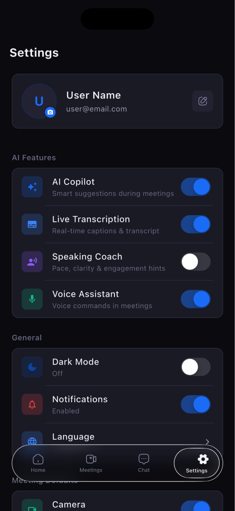 |
| 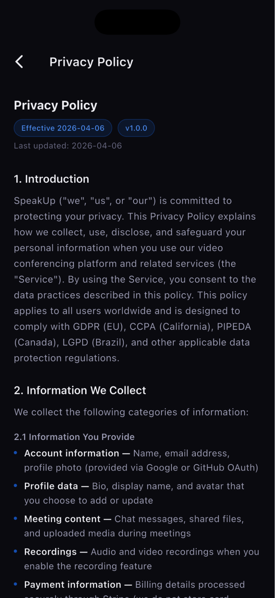 | 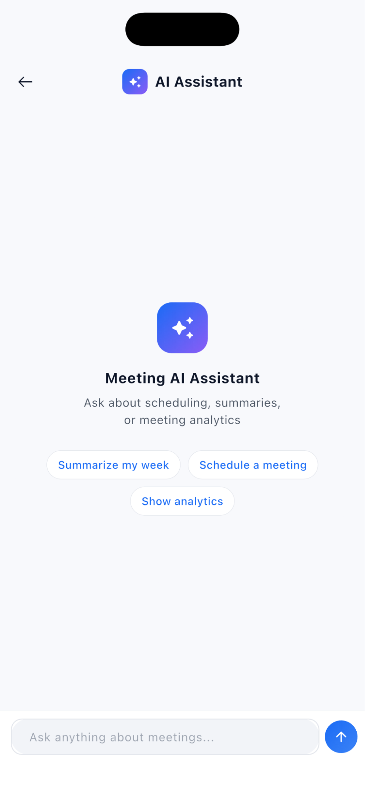 |  |  |  |
| 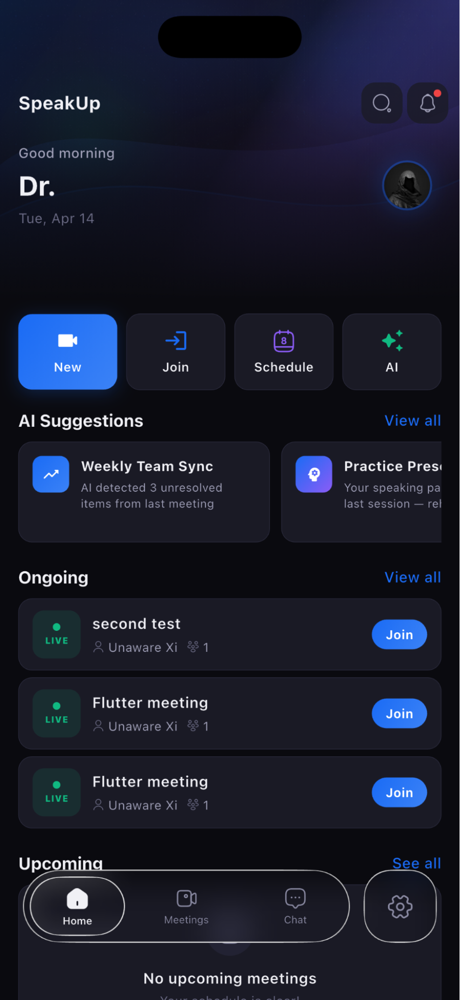 | 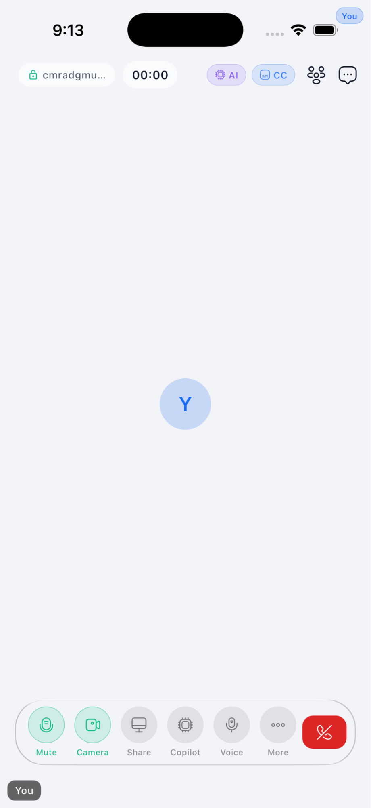 |  | 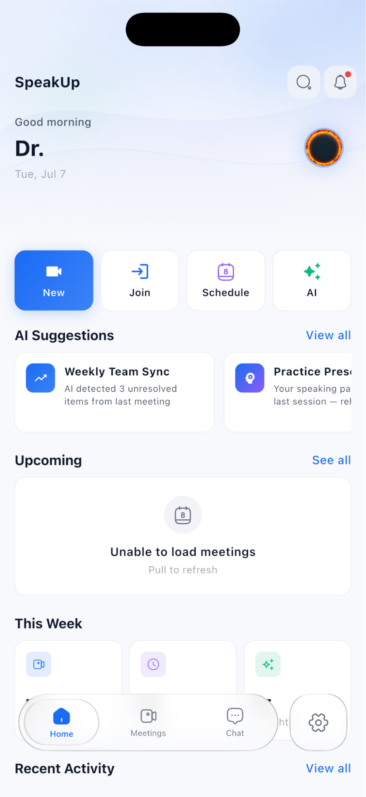 | 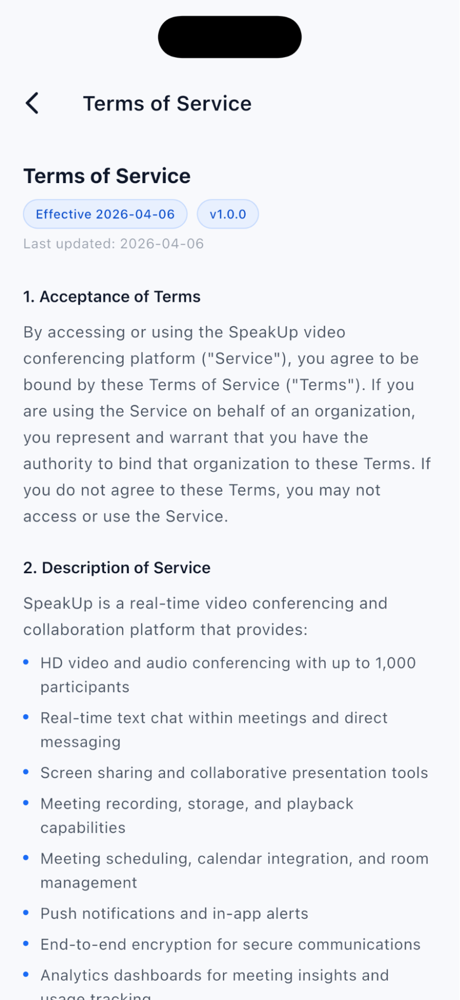 |
| 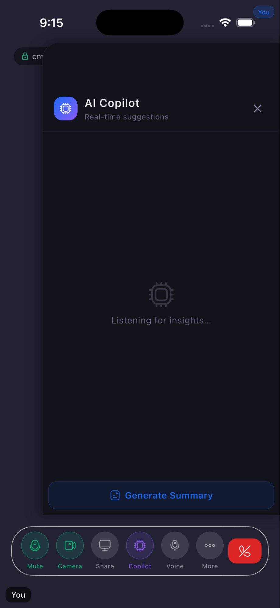 | 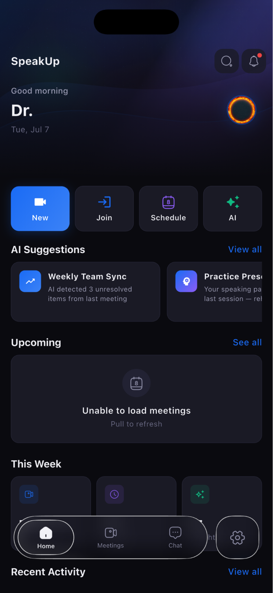 | 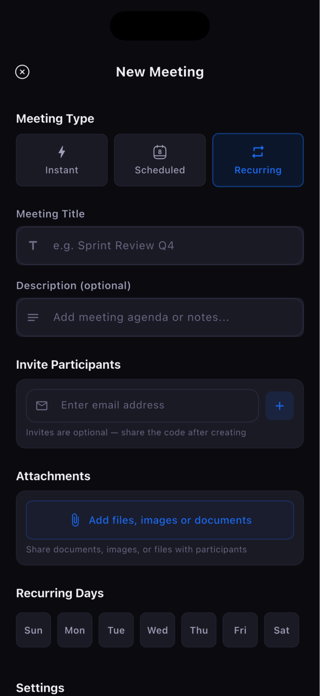 | 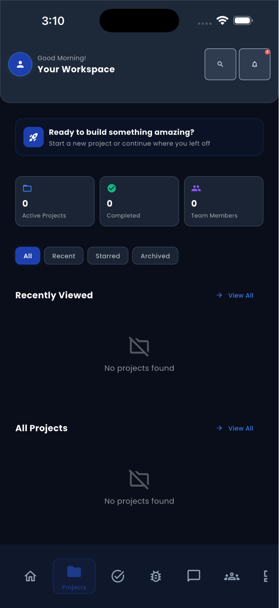 | 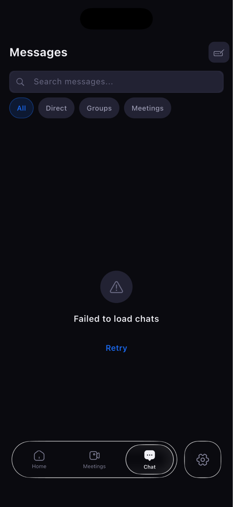 |

---

## What This Is

SpeakUp isn't just another Zoom clone. It's three independently deployable services engineered to feel like one product: a Flutter app for every screen, a hardened Express API for the business layer, and a dedicated FastAPI service that runs an AI agent pipeline alongside every meeting — transcribing, reading the room, coaching speakers, and executing real work (email, Slack, Jira, calendar, CRM) without anyone leaving the call.

## Architecture

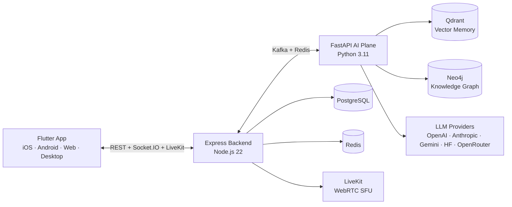

## The Three Services

| Service | Stack | Role |
| --- | --- | --- |
| **Flutter Client** | Flutter 3.11, Riverpod 2.6, GoRouter, LiveKit, Liquid Glass UI | 60+ screens across auth, meetings, chat, billing, and 32 AI feature surfaces |
| **Express Backend** | Node 22, Express 5, PostgreSQL/Prisma, Redis, Kafka, Stripe, LiveKit SDK | Auth, meetings, chat, billing, recordings, notifications — the system of record |
| **FastAPI AI Plane** | Python 3.11, LangGraph, 5 LLM providers, Whisper, MediaPipe, Qdrant, Neo4j | Real-time transcription, emotion fusion, copilot, coaching, memory, 27 MCP tools |

## Standout Features

- **Live AI Copilot** — real-time talking points, warnings, and follow-ups while you're still speaking
- **Multimodal Emotion Engine** — fuses voice, face, and text signals into soft engagement/confusion/frustration cues
- **Meeting Memory** — every meeting embedded into Qdrant + Neo4j for semantic recall and relationship intelligence across time
- **Autonomous Workflows** — post-meeting recap emails, Jira/Linear tickets, Slack summaries, and calendar follow-ups run without human input
- **Voice-Controlled Assistant** — natural language commands routed through regex + LLM parsing to 27 real tools (Gmail, Slack, GitHub, Notion, CRM, and more)
- **Production-Grade Backend** — Kafka event streaming, BullMQ jobs, Redis-backed Socket.IO scaling, Stripe billing, Prometheus/Sentry observability
- **Liquid Glass Design System** — adaptive glass UI across mobile, tablet, and desktop with platform-aware navigation

## Vision

Meetings shouldn't require a human to take notes, chase action items, or remember what was promised three weeks ago. SpeakUp's goal is a meeting layer that listens, understands, and acts — turning conversation directly into completed work across the tools teams already use.

## Roadmap & Enhancements

- Expand agent tool coverage beyond the current 27 MCP tools (finance, HR, support desks)
- On-device inference for transcription/emotion to cut latency and cost
- Federated meeting memory search across organizations with strict tenant isolation
- Deeper outcome-prediction models trained on historical meeting-to-result data
- Native desktop builds (Windows/macOS/Linux) at feature parity with mobile

## Repository Layout

| Path | Description |
| --- | --- |
| [Flutter-conference-speakup/](Flutter-conference-speakup) | Cross-platform client app |
| [Backend-conference-speakup/](Backend-conference-speakup) | Express REST/WebSocket API |
| [Fastapi-conference-speakup/](Fastapi-conference-speakup) | Python AI intelligence service |
| [webapp-conference-speakup/](webapp-conference-speakup) | Next.js web surface |

Each service ships its own `skills.md` with a complete file-by-file map for engineers and AI assistants.
